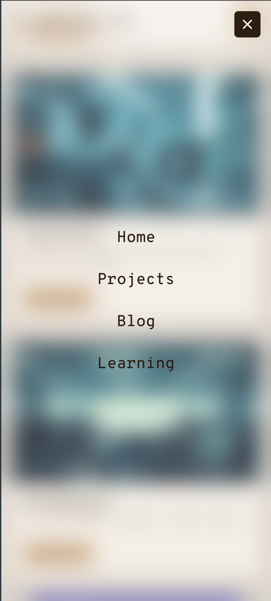
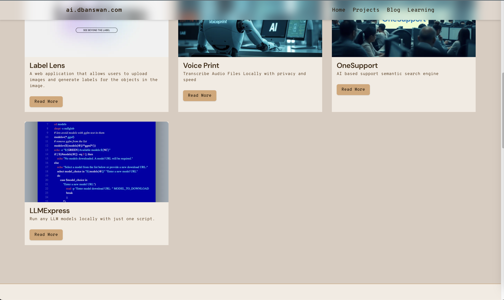

# Responsive Glass Effect Menu Component

## Why

Almost everytime I start a new project, making a responsive good looking navigation bar is one of the time consuming tasks. Hence, this component, it works great on mobile, on desktop, and it has a **glass effect**. That is all I need for a navigation bar.

You can see it in action on [ai.dbanswan.com](https://ai.dbanswan.com).

## Few things to note

1. This component assumes you are using Next.js, but you can easily modify it to work with any other React project. (remove Link and prefetch etc replace with a tags)
2. You have bit of experience with Tailwind CSS (to play around with the styles).
3. Goes without saying it is not a one size fits all solution, you might need to tweak it a bit to fit your needs.

## Few Images

### Mobile Closed


### Mobile Open



### Desktop



## Tutorial

## Building a Responsive Navigation Component with React and Tailwind CSS

This tutorial will guide you through creating a responsive navigation component with a hamburger menu for mobile devices, using React and Tailwind CSS. The component includes a glass effect, scroll-triggered styling, and ensures accessibility across all device sizes.

## Prerequisites

- Basic knowledge of React and Hooks
- Familiarity with Tailwind CSS
- A React project set up with Tailwind CSS

## Step 1: Setting Up the Component Structure

First, create a new file called `Nav.jsx` and set up the basic structure of the component:

```jsx
import React, { useState, useEffect } from 'react';
import Link from 'next/link';
import { Menu, X } from 'lucide-react';

const ResponsiveNav = () => {
  // Component logic will go here
  return (
    // JSX will go here
  );
};

export default ResponsiveNav;
```

## Step 2: Defining State and Navigation Items

Add state variables and define the navigation items:

```jsx
// State to control the mobile menu open/closed state
const [isOpen, setIsOpen] = useState(false);

// State to track if the page has been scrolled
const [isScrolled, setIsScrolled] = useState(false);

// Array of navigation items
// Each item has a href (link) and a label (text to display)
const navItems = [
  { href: "/", label: "Home" },
  { href: "/projects", label: "Projects" },
  { href: "/blog", label: "Blog" },
  { href: "/learning", label: "Learning" },
];
```

## Step 3: Implementing the Toggle Function

Create a function to toggle the mobile menu and handle scrolling:

```jsx
const toggleMenu = () => {
  setIsOpen(!isOpen);
  if (!isOpen) {
    // Prevent scrolling on the main page when menu is open
    document.body.style.overflow = "hidden";
    // Fix the body height to prevent resizing on mobile when the address bar appears/disappears
    document.body.style.height = "100vh";
  } else {
    // Re-enable scrolling when menu is closed
    document.body.style.overflow = "unset";
    // Reset the body height
    document.body.style.height = "auto";
  }
};
```

## Step 4: Adding Scroll Detection

Implement a scroll detection effect using `useEffect`:

```jsx
useEffect(() => {
  // Function to handle scroll events
  const handleScroll = () => {
    // Check if page has been scrolled more than 20 pixels
    setIsScrolled(window.scrollY > 20);
  };

  // Add scroll event listener when component mounts
  window.addEventListener("scroll", handleScroll);

  // Cleanup function to remove event listener when component unmounts
  return () => {
    window.removeEventListener("scroll", handleScroll);
    // Ensure scrolling is re-enabled when component unmounts
    document.body.style.overflow = "unset";
    document.body.style.height = "auto";
  };
}, []); // Empty dependency array ensures this effect runs only once on mount
```

## Step 5: Building the Desktop Navigation

Create the desktop navigation structure:

```jsx
<nav
  className={`fixed top-0 left-0 right-0 z-10 transition-all duration-300 ${
    // Apply glass effect and shadow when page is scrolled
    isScrolled
      ? "bg-white bg-opacity-20 backdrop-blur-lg shadow-md"
      : "bg-transparent"
  }`}
>
  <div className="max-w-7xl mx-auto px-4 sm:px-6 lg:px-8">
    <div className="flex items-center justify-between h-16">
      {/* Logo or brand name */}
      <div className="flex-shrink-0">
        <span className="text-2xl font-bold">Logo</span>
      </div>

      {/* Desktop menu items */}
      <div className="hidden md:flex gap-6">
        {navItems.map((item) => (
          <Link
            key={item.href}
            href={item.href}
            className="text-lg font-medium hover:underline underline-offset-4"
            prefetch={false}
          >
            {item.label}
          </Link>
        ))}
      </div>

      {/* Hamburger menu button (visible only on mobile) */}
      <button
        onClick={toggleMenu}
        className="md:hidden p-2 rounded-md bg-gray-800 text-white"
        aria-label="Open menu"
      >
        <Menu size={24} />
      </button>
    </div>
  </div>
</nav>
```

## Step 6: Implementing the Mobile Menu

Add the mobile menu overlay:

```jsx
{
  /* Render mobile menu only when isOpen is true */
}
{
  isOpen && (
    <div className="fixed inset-0 z-50 bg-white bg-opacity-20 backdrop-blur-lg md:hidden overflow-y-auto">
      {/* Close button for mobile menu */}
      <button
        onClick={toggleMenu}
        className="fixed top-4 right-4 p-2 rounded-md bg-gray-800 text-white"
        aria-label="Close menu"
      >
        <X size={24} />
      </button>

      {/* Mobile menu items */}
      <div className="flex flex-col items-center justify-center min-h-screen gap-8 py-20">
        {navItems.map((item) => (
          <Link
            key={item.href}
            href={item.href}
            className="text-2xl font-medium hover:underline underline-offset-4"
            prefetch={false}
            onClick={toggleMenu} // Close menu when an item is clicked
          >
            {item.label}
          </Link>
        ))}
      </div>
    </div>
  );
}
```

## Step 7: Finalizing the Component

Wrap everything together in the return statement:

```jsx
return (
  <>
    {/* Desktop Navigation */}
    <nav>{/* ... */}</nav>

    {/* Mobile Menu */}
    {isOpen && <div>{/* ... */}</div>}
  </>
);
```

## Key Features Explained

1. **Responsive Design**:

   - The component uses Tailwind's responsive classes (e.g., `hidden md:flex`) to show/hide elements based on screen size.
   - On larger screens (md and up), the full menu is displayed.
   - On smaller screens, a hamburger menu icon is shown.

2. **Hamburger Menu**:

   - On mobile, a hamburger icon opens the full-screen menu overlay.
   - The menu is toggled using the `isOpen` state variable.

3. **Glass Effect**:

   - Achieved using `bg-white bg-opacity-20 backdrop-blur-lg` Tailwind classes.
   - This creates a semi-transparent, blurred background effect.

4. **Scroll-Triggered Styling**:

   - The `isScrolled` state changes the navigation bar's appearance when the page is scrolled.
   - This adds visual interest and improves readability as the user scrolls.

5. **Accessibility**:

   - Proper `aria-label` attributes are used for the menu buttons.
   - This ensures screen readers can properly interpret the purpose of these buttons.

6. **Scroll Lock**:

   - When the mobile menu is open, scrolling is prevented on the main content.
   - This is achieved by setting `document.body.style.overflow = 'hidden'`.
   - This improves the user experience by focusing attention on the menu.

7. **Performance Considerations**:
   - The scroll event listener is added and removed appropriately to prevent memory leaks.
   - The `useEffect` hook with an empty dependency array ensures the scroll listener is only set up once.

## Conclusion

This responsive navigation component provides a sleek, modern interface that works well across all device sizes. It demonstrates the power of combining React's state management with Tailwind CSS for styling.

The use of React's `useState` and `useEffect` hooks allows for dynamic behavior based on user interactions and scroll position. Tailwind CSS classes provide a quick and efficient way to style the component responsively.

Feel free to customize the colors, spacing, and other design elements to match your project's needs. You can also extend the functionality, perhaps by adding animations or integrating with a state management library for more complex applications.

Remember to test the component thoroughly across different devices and browsers to ensure consistent behavior. Happy coding!
